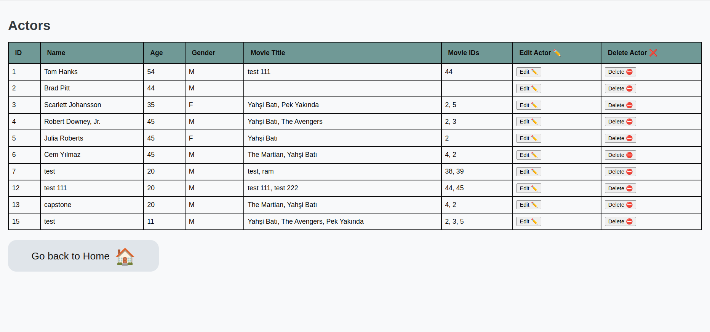

# Casting Agency Project
Udacity Full-Stack Web Developer Nanodegree Program Capstone Project

## Project Motivation
The Casting Agency Project models a company that is responsible for creating movies and managing and assigning actors to those movies. You are an Executive Producer within the company and are creating a system to simplify and streamline your process. 


This project is simply a workspace for practicing and showcasing different set of skills related with web development. These include data modelling, API design, authentication and authorization and cloud deployment.

# YouTube video link 
 - ### Project's YouTube video link :-  https://youtu.be/O02NiBLoulo

--- 
# Screenshots

## HOME

### Home without login 
   

### Auth0 login page
   

### Home with login 
   

## Movie

### Movies home
   

### Create movie
   

   

### Edit movie
   

### Delete movie
   

   


## Actor 

### Actor home
   

### Actor create
   

### Actor create with invalid movie id
   

### Actor edit with invalid movie id
   

### Actor edit with valid movie id 
   
   

### Actor delete
   
   

### Try to acess data by route without logout
   

### When don't have permisson and try to perform task
   

### When don't have permisson and try to perform task(Message)
   


### Key Dependencies & Platforms

- [Flask](http://flask.pocoo.org/)  is a lightweight backend microservices framework. Flask is required to handle requests and responses.

- [SQLAlchemy](https://www.sqlalchemy.org/) is the Python SQL toolkit and ORM we'll use handle the lightweight sqlite database. You'll primarily work in app.py and can reference models.py. 

- [Flask-CORS](https://flask-cors.readthedocs.io/en/latest/#) is the extension we'll use to handle cross origin requests from our frontend server. 

- [Auth0](https://auth0.com/docs/) is the authentication and authorization system we'll use to handle users with different roles with more secure and easy ways

- [PostgreSQL](https://www.postgresql.org/) this project is integrated with a popular relational database PostgreSQL, though other relational databases can be used with a little effort.

- [Heroku](https://www.heroku.com/what) is the cloud platform used for deployment


### Running Locally

#### Installing Dependencies

##### Python 3.10.12

Follow instructions to install the latest version of python for your platform in the [python docs](https://docs.python.org/3/using/unix.html#getting-and-installing-the-latest-version-of-python)

##### Virtual Environment

We recommend working within a virtual environment whenever using Python for projects. This keeps your dependencies for each project separate and organized. Instructions for setting up a virtual environment for your platform can be found in the [python docs](https://packaging.python.org/guides/installing-using-pip-and-virtual-environments/)

Once you have your virtual environment setup and running, install dependencies by running:

```bash
pip install -r requirements.txt
```

This will install all of the required packages we selected within the `requirements.txt` file.

#### Database Setup
With Postgres running, restore a database using the `capstone.psql` file provided. In terminal run:

```bash
createdb capstone
psql capstone < capstone.psql
```

#### Running Tests
To run the tests, run
```bash
dropdb capstone_test
createdb capstone_test
psql capstone_test < capstone.psql
python test_app.py
```

Optionally, you can use `run_test.sh` script.

#### Auth0 Setup

You need to setup an Auth0 account.

Environment variables needed: (setup.sh)

```bash
export AUTH0_DOMAIN="xxxxxxxxxx.auth0.com" # Choose your tenant domain
export ALGORITHMS="RS256"
export API_AUDIENCE="capstone" # Create an API in Auth0
```

##### Roles

Create three roles for users under `Users & Roles` section in Auth0

* Casting Assistant
	* Can view actors and movies
* Casting Director
	* All permissions a Casting Assistant has and…
	* Add or delete an actor from the database
	* Modify actors or movies
* Executive Producer
	* All permissions a Casting Director has and…
	* Add or delete a movie from the database

##### Permissions

Following permissions should be created under created API settings.

* `view:actors`
* `view:movies`
* `delete:actors`
* `post:actors`
* `update:actors`
* `update:movies`
* `post:movies`
* `delete:movies`

##### Set JWT Tokens in `auth_config.json`

Use the following link to create users and sign them in. This way, you can generate 

```
https://{{YOUR_DOMAIN}}/authorize?audience={{API_IDENTIFIER}}&response_type=token&client_id={{YOUR_CLIENT_ID}}&redirect_uri={{YOUR_CALLBACK_URI}}
```

#### Launching The App

1. Initialize and activate a virtualenv:

   ```bash
   virtualenv --no-site-packages env_capstone
   source env_capstone/bin/activate
   ```

2. Install the dependencies:

    ```bash
    pip install -r requirements.txt
    ```
3. Configure database path to connect local postgres database in `models.py`

    ```python
    database_path = "postgres://{}/{}".format('localhost:5432', 'capstone')
    ```
**Note:** For default postgres installation, default user name is `postgres` with no password. Thus, no need to speficify them in database path. You can also omit host and post (localhost:5432). But if you need, you can use this template:

```
postgresql://[user[:password]@][netloc][:port][/dbname][?param1=value1&...]
```
For more details [look at the documentation (31.1.1.2. Connection URIs)](https://www.postgresql.org/docs/9.3/libpq-connect.html)

4. Setup the environment variables for Auth0 under `setup.sh` running:
	```bash
	source ./setup.sh 
	```
5.  To run the server locally, execute:

    ```bash
    export FLASK_APP=flaskr
    export FLASK_DEBUG=True
    export FLASK_ENVIRONMENT=debug
    flask run --reload
    ```

    Optionally, you can use `run.sh` script.

## API Documentation

### Models
There are two models:
* Movie
	* title
	* release_date
* Actor
	* name
	* age
	* gender


### Endpoints


#### GET /movies 
* Get all movies

* Require `view:movies` permission

* **Example Request:** `curl 'http://localhost:5000/movies'`

* **Expected Result:**
    ```json
        {
        "movies": [
            {
            "actors": [
                {
                "age": 45,
                "gender": "F",
                "id": 5,
                "name": "Julia Roberts"
                },
                {
                "age": 45,
                "gender": "M",
                "id": 4,
                "name": "Robert Downey, Jr."
                }
            ],
            "id": 2,
            "release_date": "Mon, 30 Apr 2012 00:00:00 GMT",
            "title": "Yah\u015fi Bat\u0131"
            },
        
          ......

        ],
        "success": true
        }
    	```

#### GET /actors 
* Get all actors

* Requires `view:actors` permission

* **Example Request:** `curl 'http://localhost:5000/actors'`

* **Expected Result:**
    ```json
	{
		"actors": [
			{
            "age": 35,
            "gender": "F",
            "id": 3,
            "movies": [
                {
                "id": 3,
                "release_date": "Tue, 11 May 2010 00:00:00 GMT",
                "title": "The Avengers"
                }
            ],
            "name": "Scarlett Johansson"
            },
        
        .....

		],
		"success": true
	}
	```

#### POST /create_movie
* Creates a new movie.

* Requires `post:movies` permission

* Requires the title and release date.

* **Example Request:** (Create)
    ```bash
	curl --location --request POST 'http://localhost:5000/create_movie' \
		--header 'Content-Type: application/json' \
		--data-raw '{
			"title": "Pek Yakında",
			"release_date": "19-02-2020",
            "actors": "Brad Pitt"
		}'
    ```
    
* **Example Response:**
    ```bash
	{
		"success": true
	}
    ```

#### POST /create_actor
* Creates a new actor.

* Requires `post:actors` permission

* Requires the name, age and gender of the actor.

* **Example Request:** (Create)
    ```json
	curl --location --request POST 'http://localhost:5000/create_actor' \
		--header 'Content-Type: application/json' \
		--data-raw '{
			"name": "Cem Yılmaz",
			"age": "45",
			"gender": "M",
            "movie_ids": "2,5"  (Use comma-separated for add multiple value)
        }'
    ```
    
* **Example Response:**
    ```json
	{
		"success": true
    }
    ```

#### POST /delete_movie/<int:movie_id>
* Deletes the movie with given id 

* Require `delete:movies` permission

* **Example Request:** `curl --request POST 'http://localhost:5000/delete_movie/1'`

* **Example Response:**
    ```json
	{
		"deleted": 1,
		"success": true
    }
    ```
    
#### POST /delete_actor/<int:actor_id>
* Deletes the actor with given id 

* Require `delete:actors` permission

* **Example Request:** `curl --request POST 'http://localhost:5000/delete_actor/1'`

* **Example Response:**
    ```json
	{
		"deleted": 1,
		"success": true
    }
    ```

#### PATCH /edit_movie/<movie_id>
* Updates the movie where <movie_id> is the existing movie id

* Require `update:movies` permission

* Responds with a 404 error if <movie_id> is not found

* Update the corresponding fields for Movie with id <movie_id>

* **Example Request:** 
	```json
    curl --location --request PATCH 'http://localhost:5000/edit_movie/1' \
		--header 'Content-Type: application/json' \
		--data-raw '{
			"title": "Eyvah eyvah 2",
            "release_date": "19-02-2020",
            "actors": "Brad Pitt"
        }'
  ```
  
* **Example Response:**
    ```json
	{
		"success": true, 
		"updated": {
			"id": 1, 
			"release_date": "Wed, 04 May 2016 00:00:00 GMT", 
			"title": "Eyvah eyvah 2",
            "actors": "Brad Pitt"

		}
    }
    ```
	
#### PATCH /edit_actor/<actor_id>
* Updates the actor where <actor_id> is the existing actor id

* Require `update:actors`

* Responds with a 404 error if <actor_id> is not found

* Update the given fields for Actor with id <actor_id>

* **Example Request:** 
	```json
    curl --location --request PATCH 'http://localhost:5000/edit_actor/1' \
		--header 'Content-Type: application/json' \
		--data-raw '{
			"name": "Tom Hanks",
            "age": "45",
			"gender": "M",
            "movie_ids": "2,5"  (Use comma-separated for add multiple value)
        }'
  ```
  
* **Example Response:**
    ```json
	{
		"success": true, 
		"updated": {
			"age": 54, 
			"gender": "M", 
			"id": 1, 
			"name": "Tom Hanks",
            "movie_ids": "2,5"
		}
	}
	```

