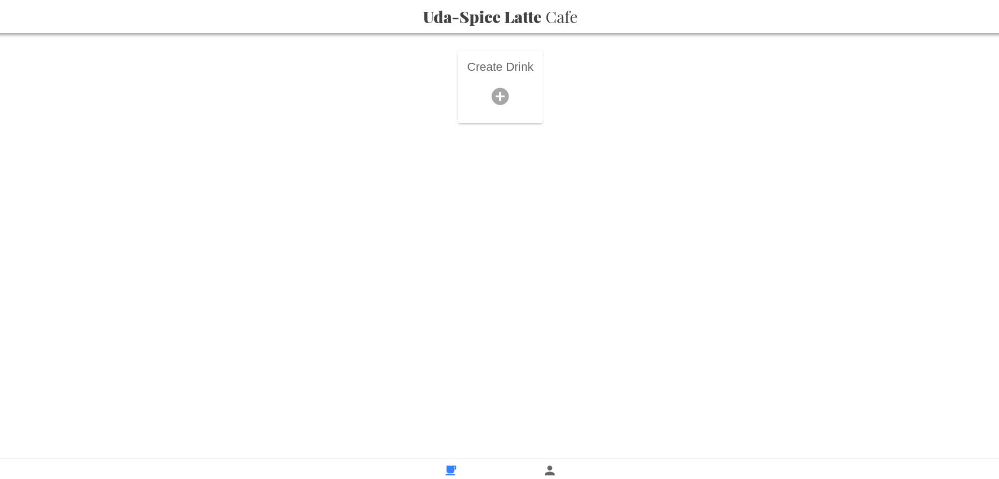
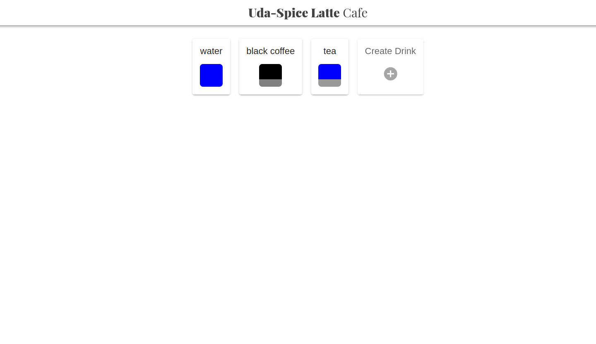
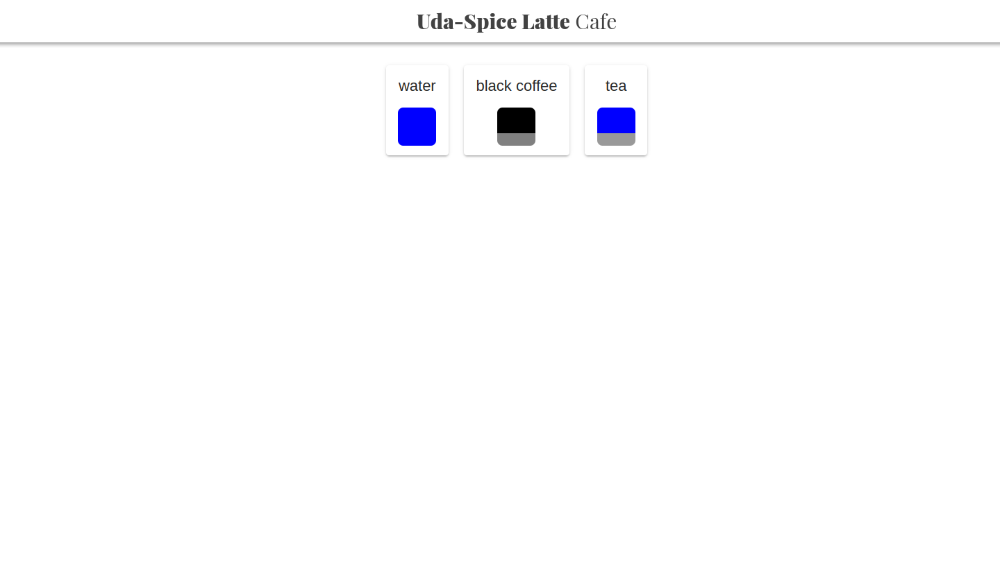
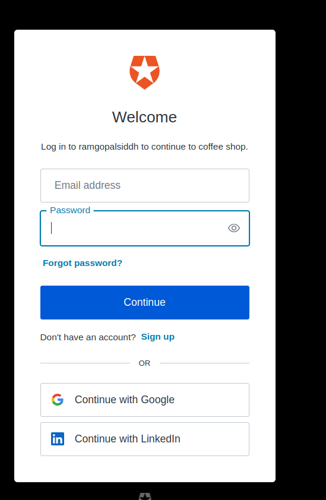
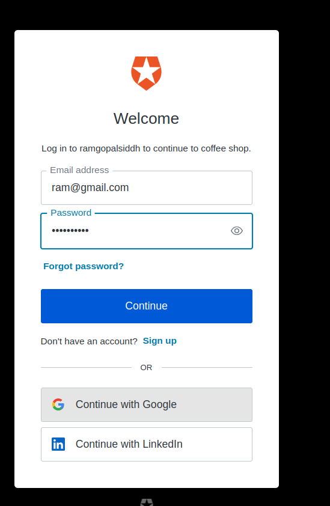
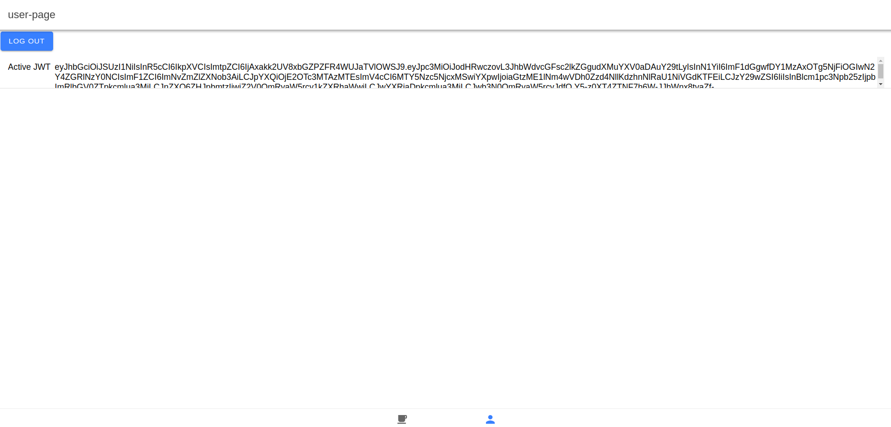
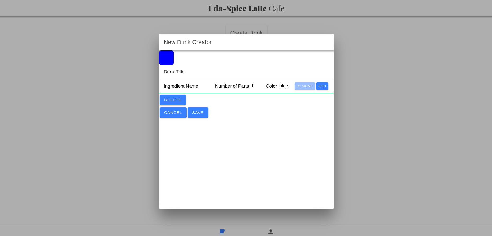
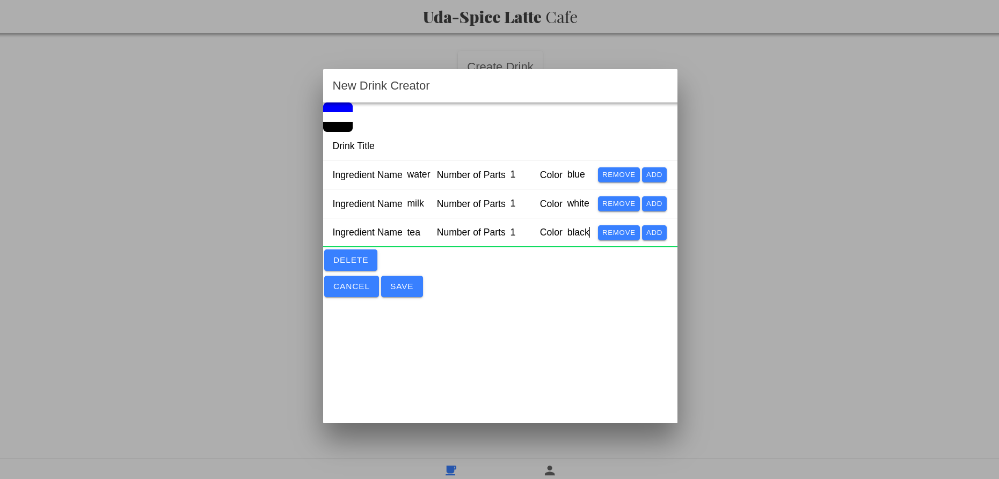
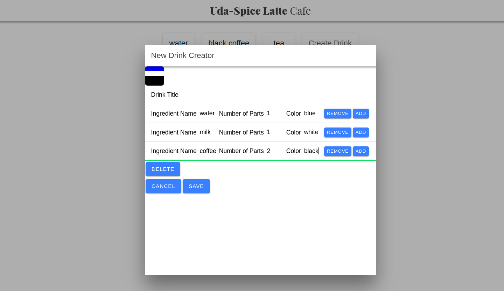

# Coffee Shop Full Stack

## Full Stack Nano - IAM Final Project

Udacity has decided to open a new digitally enabled cafe for students to order drinks, socialize, and study hard. But they need help setting up their menu experience.

# screenshots

### home page when manager login

 

 

### home page when barista login

  

  ### Auth0 Authentication login page 

   

   

  ### user page after login (jwt token)
   

  ### create drink page (only manager has access for create drink)

   

   

   

---

You have been called on to demonstrate your newly learned skills to create a full stack drink menu application. The application must:

1. Display graphics representing the ratios of ingredients in each drink.
2. Allow public users to view drink names and graphics.
3. Allow the shop baristas to see the recipe information.
4. Allow the shop managers to create new drinks and edit existing drinks.

## Tasks

There are `@TODO` comments throughout the project. We recommend tackling the sections in order. Start by reading the READMEs in:

1. [`./backend/`](./backend/README.md)
2. [`./frontend/`](./frontend/README.md)

## About the Stack

We started the full stack application for you. It is designed with some key functional areas:

### Backend

The `./backend` directory contains a partially completed Flask server with a pre-written SQLAlchemy module to simplify your data needs. You will need to complete the required endpoints, configure, and integrate Auth0 for authentication.

[View the README.md within ./backend for more details.](./backend/README.md)

### Frontend

The `./frontend` directory contains a complete Ionic frontend to consume the data from the Flask server. You will only need to update the environment variables found within (./frontend/src/environment/environment.ts) to reflect the Auth0 configuration details set up for the backend app.

[View the README.md within ./frontend for more details.](./frontend/README.md)
